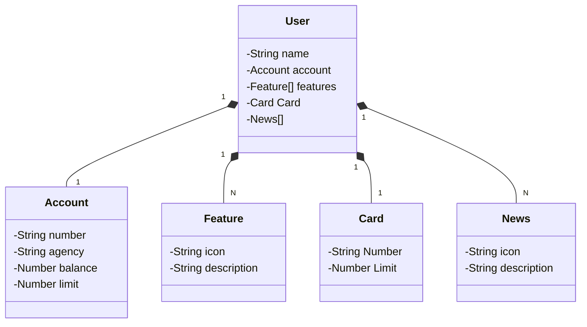

# Santander Dev-Week 2024

Java RESTFul API Criada para a Santander DevWeek 2024

## Diagrama de Classes

```mermaid
classDiagram
    class User {
        -String name
        -Account account
        -Feature[] features
        -Card Card
        -News[]
    }
    
    class Account {
        -String number
        -String agency
        -Number balance
	    -Number limit
    }
    
    class Feature {
        -String icon
        -String description
    }
    
    class Card {
        -String Number
        -Number Limit
    }
    
    class News {
        -String icon
        -String description
    }
    
    User "1" *-- "1" Account
    User "1" *-- "N" Feature
    User "1" *-- "1" Card
    User "1" *-- "N" News
```
